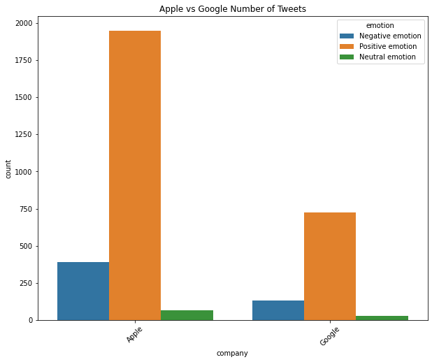
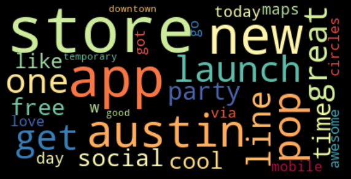
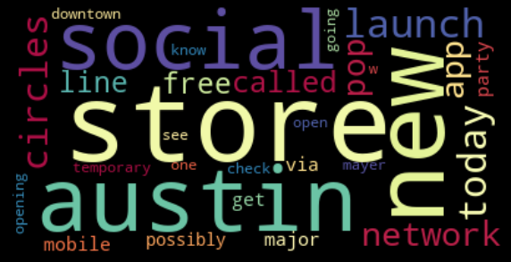
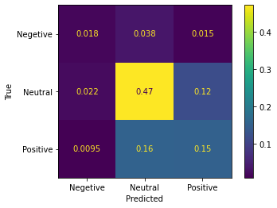
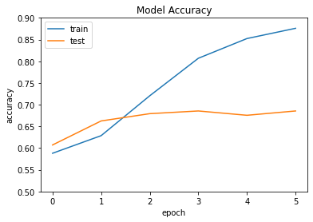
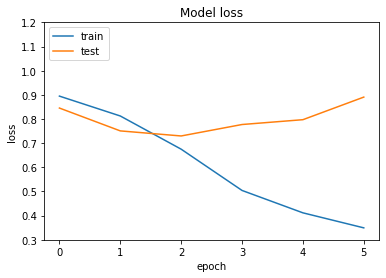

# NLP Model to Analyze Twitter Sentiment 

Objective of this project is to perform supervised sentiment analysis on Twitter tweets about Google and <br>Apple products using Natural Language Processing(NLP) model, so the model can rate the sentiment of <br>a Tweet based on its content.

# Data

Obtained the dataset from **CrowdFlower**  <br> Source: https://www.crowdflower.com/data-for-everyone/<br>
This dataset has tweets of human raters rated the sentiment in over 9000 Tweets as Positive, Negative,or Neutral. It has 3 columns 
- **tweet_text**: Tweet text and user name 
- **emotion_in_tweet_is_directed_at**: Name of brand or service   
- **is_there_an_emotion_directed_at_a_brand_or_product**: Emotion i.e.Negative <br>Renamed the column names since they are really long with '**tweet_text**', '**emotion_directed_at**', and '**emotion**'.

# Scrub

In this stage, we'll focus on preprocessing our data.

- Important steps such as identifying and handling null values in the columns.
- Replaced the emotion column values "No emotion toward brand or product" with "Neutral emotion" to build a multiclass classifier. 
- Removed stopwords from tweets.
- Tokenized the tweets.

# Explore

Visualization of the data using Seaborn and Matplotlib.

Counter plot of tweets emotion towards the brands.



Noticed in the graph above Apple and Google has more Positive emotion than Negative or Neutral emotions. Also Apple has more tweets then Google.

**WordClouds(Positive,Negetive,Neutral Tweets)**

**Positive Tweets**



**Negative Tweets**


**Neutral Tweets**



# Model


Vectorized the tweets using **Tfidf** Vectorization (Term Frequency Inverse Document Frequency).<br>Performed couple of different models, Logistic regression as the base model then Decision Tree, Random Forest, <br>Random Forest wtih GridSearch and Naive Bayes models. Most of the models are overfitted i.e. F1-Score of the <br>Train set is larger than the Test set. The confusion matrix  of Naive Bayes Model with 
- Accuracy : 64% 
- Train sets F1-Score: 87% 
- Test sets F1-Score : 63%.<br>**Confusion Matrix of Test Set**


**Deep NLP with Word Embedding**

Using an Embedding Layer inside of a deep neural network to compute the word embedding vectors <br>on the tweets in the Sequential model.<br>Model Summary :

Model: "sequential"
_________________________________________________________________
Layer (type)                 Output Shape              Param #   
=================================================================
embedding (Embedding)        (None, None, 128)         2560000   
_________________________________________________________________
lstm (LSTM)                  (None, None, 25)          15400     
_________________________________________________________________
global_max_pooling1d (Global (None, 25)                0         
_________________________________________________________________
dropout (Dropout)            (None, 25)                0         
_________________________________________________________________
dense (Dense)                (None, 50)                1300      
_________________________________________________________________
dropout_1 (Dropout)          (None, 50)                0         
_________________________________________________________________
dense_1 (Dense)              (None, 3)                 153       
=================================================================
Total params: 2,576,853
Trainable params: 2,576,853
Non-trainable params: 0
**loss Function and Accuracy of this model<br>**
**Train score:** 0.37, 87%<br>
**Test Score:** 0.97, 66%

 **Plots of Accuracy and loss Function**





# Conclusion

Performed different models on the data, such as Logistic Regression, Decision Tree, Random Forest, Random Forest<br> with GridSearch and Naive Bayes classifiers, all models got 60% or less than 70% of accuracy and F1-Score of training<br> set is nearly 20% more than the test set which seems overfitting.
Built a deep neural network with<br> Word Embeddings layers any Accuracy of Train set is 87% and loss function is 0.36 and Accuracy of test set <br>is 66% and loss function is 0.97, the difference of loss function is more than twice, so this model is also overfitted.


```python

```
